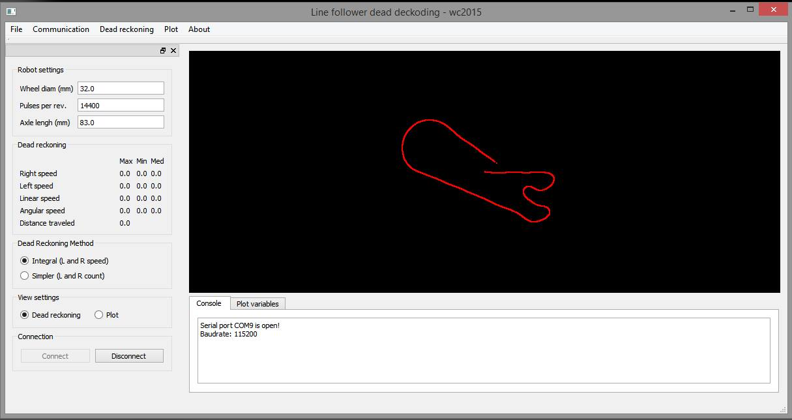

# LFTracking  

3D QtOpenGL visual tracking for linefollower project with bluetooth using just high resolution AMS magnetic encoders.

# Real test

Road to track  

velocity of 400mm/s

velocity of 800mm/s

# Additional features

Plots of pid velocity control.  

